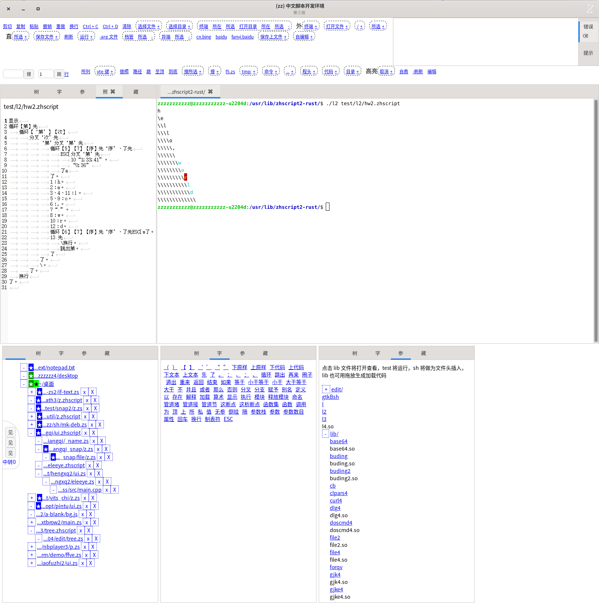

# 中文脚本锈版贰点零之全貌

* 这是在实际使用中的情形
* ubuntu 18.04 64位下编译，亦能直接运行或安装某些依赖库后运行于后继版本系统上

edit：由脚本写就的集成开发环境，后附如何启动以及截屏。

l2：纯粹的解释器，对应的就是 zhscript2-rust 开源项目。

l4.so：解释器或称加强的能够调用动态库的解释器，对应 l4-rust 项目（内含 zhscript2-rust、zs2-l4-rust）。

l：c++ 编写的 l4.so 装载程序，这也是最简单的一个外壳程序。

gtkBsh：“乙壳”，把脚本做为界面描述语言的命令参数式的通用 gui 程序，目前支持“终端”、“网页”、“源码”三种视图（插件）。

lib：库目录，供解释器调用的动态库及其接口文件，后者是脚本（系统动态库的话便只有脚本），大部分由 c++ 编写，少为 rustlang。

plugin、webkitx：插件目录。

test：一些用于测试的脚本。

webkitAsh：“甲壳”。

zsp：中文动态网页第二版，对应 zsp2-rust 项目。

##### 运行开发环境

* 相当程度上，这个开发环境从实践层面说明了解释器到底有什么用，诸般外壳、库到底做什么用、如何来用

```bash
$ ./edit/edit3_zs
```

或者进入 edit 目录点击 start.desktop（特定文件管理器里显示“启动”）

###### 截屏



